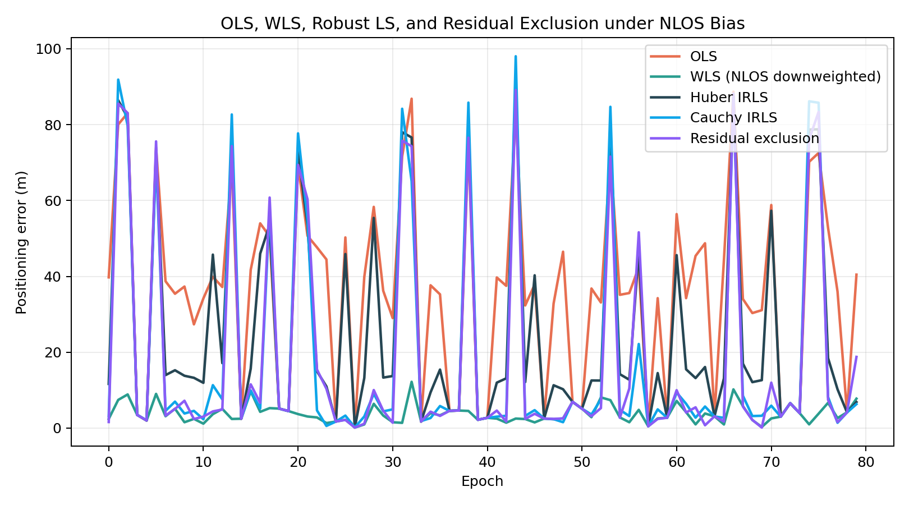
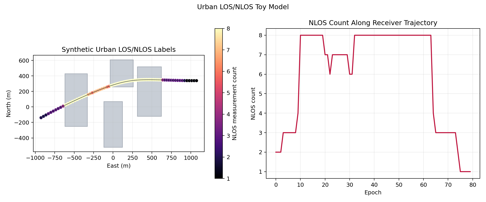
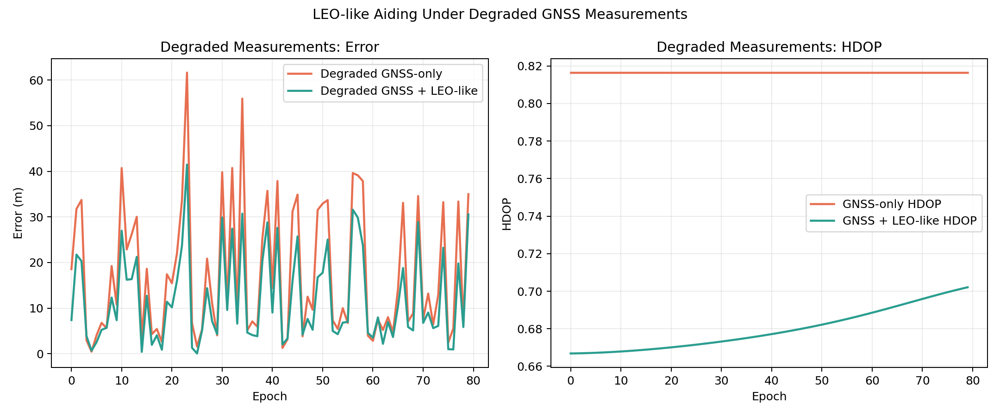
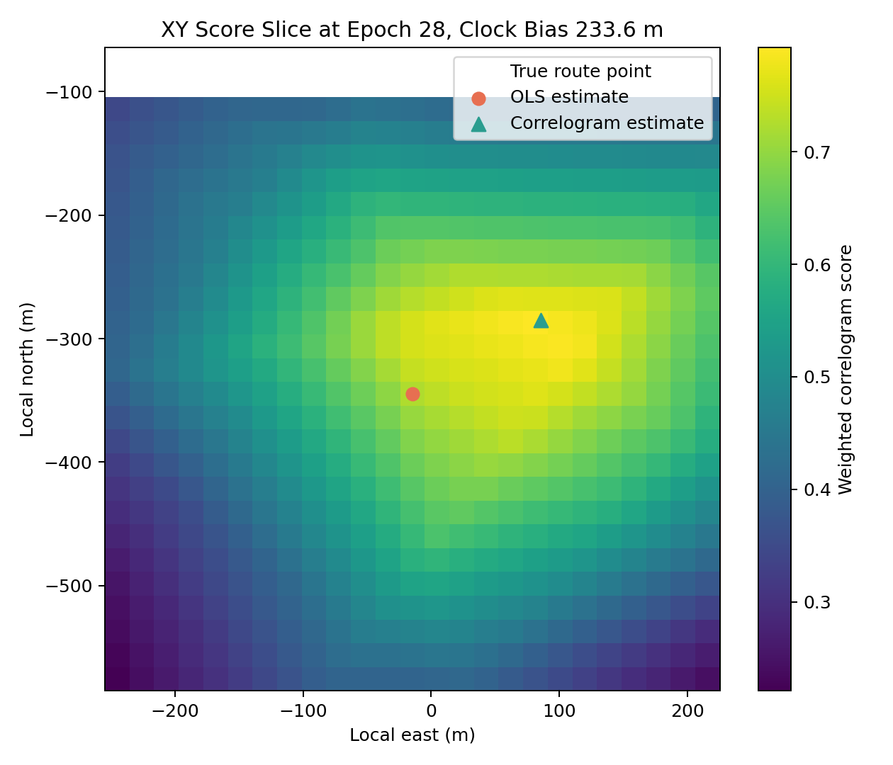
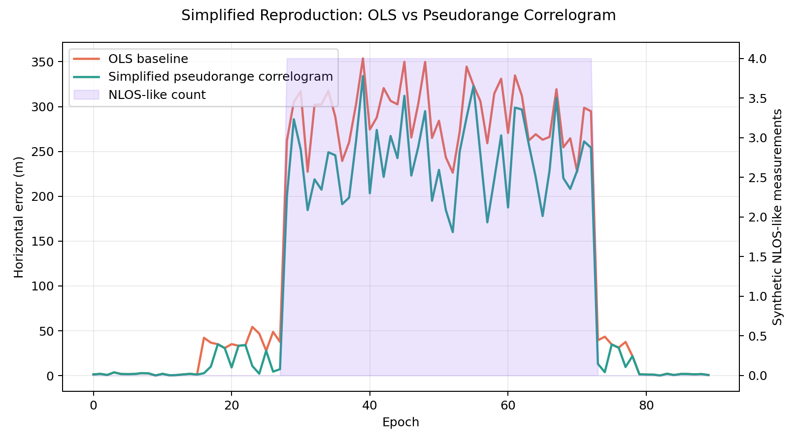

# GNSS Urban PNT MiniLab

This repository is a small research-preparation project for learning GNSS positioning, urban PNT degradation, robust pseudorange estimation, and simplified LEO-like ranging assistance.

The intended reader is an academic supervisor or mentor who would like to understand my self-study preparation in GNSS positioning and assisted PNT. The project was organized around the preparation path of first strengthening GNSS positioning fundamentals, then gradually moving toward multipath, spoofing-like measurement anomalies, and LEO PNT topics. It is not a research-grade receiver. Its purpose is to show that I have started building the mathematical, simulation, coding, and experimental-analysis foundation needed for future work in satellite navigation.

The repository is organized as a GNSS positioning and assisted-PNT learning portfolio, with emphasis on pseudorange positioning, NLOS/multipath robustness, LEO-like ranging assistance, and a pseudorange-correlogram-inspired conceptual replication.

## Quick Review

- `docs/prof_xu_update.md`: one-page update for the GNSS signal processing / LEO-like assisted PNT direction.
- `results/selected/`: five curated result figures for a fast visual review.
- `reproduction/method_scope.md`: exact boundary of the pseudorange-correlogram-inspired conceptual replication.
- `docs/limitations.md`: technical and presentation limitations.

## Two-Minute Overview

**Motivation.** Urban GNSS positioning is affected by satellite geometry, receiver clock bias, NLOS / multipath errors, and the availability of aiding sources. This MiniLab gives me a controlled environment to study those effects step by step.

**What I implemented.** The project includes pseudorange positioning with clock-bias estimation, OLS/WLS/Huber/Cauchy/residual-exclusion solvers, DOP/HDOP geometry analysis, synthetic urban LOS/NLOS degradation, simplified LEO-like ranging-source aiding, and a pseudorange-correlogram-inspired candidate-search toy experiment.

**Preparation path.** The project follows the preparation path of learning GNSS positioning fundamentals first, then moving toward multipath / NLOS robustness, spoofing-like measurement anomalies, and LEO PNT concepts.

**Main limitation.** This is a synthetic 2D educational project. It does not process real RINEX, IF samples, ephemerides, carrier phase, real C/N0 logs, or real LEO orbit models.

**How to run.** Install `requirements.txt`, then run `python app.py`, `python experiments/run_all_experiments.py`, `python reproduction/run_reproduction.py`, or `python -m unittest discover -s tests -v`.

## What This MiniLab Demonstrates

1. GNSS pseudorange positioning and receiver clock-bias estimation.
2. OLS, WLS, Huber IRLS, Cauchy IRLS, and residual-exclusion baselines under synthetic NLOS / multipath-like pseudorange errors.
3. DOP / HDOP geometry analysis for simplified 2D ranging-source configurations.
4. Simplified LEO-like ranging-source aiding to study how additional geometry may affect HDOP and positioning error.
5. A pseudorange-correlogram-inspired toy experiment based on candidate-state scoring, pseudorange consistency, and synthetic C/N0-like weighting.
6. Clear experiment scripts and unit tests so the figures and metrics can be regenerated.

## Selected Results

The selected figures for a GitHub / supervisor-facing portfolio are stored in `results/selected/`.



**Figure 1. Controlled robust solver comparison.** OLS, WLS, Huber IRLS, Cauchy IRLS, and residual exclusion are compared under synthetic NLOS / multipath-like pseudorange bias. The result shows how measurement weighting and robust estimation can reduce sensitivity to biased ranges in a simplified setting.



**Figure 2. Synthetic urban LOS/NLOS demonstration.** A simplified 2D urban-canyon model uses rectangular building blocks to label receiver-to-source links as LOS or NLOS. NLOS measurements are assigned larger uncertainty and positive range bias in later experiments.



**Figure 3. GNSS + LEO-like aiding under degraded measurements.** The experiment compares GNSS-only and GNSS + LEO-like aiding when NLOS / multipath-like biases are present. It illustrates that better geometry alone does not guarantee lower positioning error if biased measurements are not handled.



**Figure 4. Pseudorange-correlogram-inspired candidate score map.** A toy candidate-state search evaluates pseudorange consistency and synthetic C/N0-like weights over a 2D state grid. This is an educational conceptual replication, not an exact implementation of the original UrbanNav/RINEX experiment.



**Figure 5. OLS vs pseudorange-correlogram-inspired toy method.** Under the fixed synthetic NLOS-dominated scenario, candidate scoring is compared with an OLS pseudorange solution over time.

## Quick Start

Install dependencies:

```bash
pip install -r requirements.txt
```

Run the desktop GUI:

```bash
python app.py
```

Run all main experiments and regenerate full results:

```bash
python experiments/run_all_experiments.py
```

Run the pseudorange-correlogram-inspired toy experiment:

```bash
python reproduction/run_reproduction.py
```

Run tests:

```bash
python -m unittest discover -s tests -v
```

## Project Structure

```text
.
|-- app.py                         # Tkinter GUI for interactive experiments
|-- src/                           # Core positioning, geometry, and simulation modules
|-- experiments/                   # Reproducible synthetic experiment scripts
|-- reproduction/                  # Pseudorange-correlogram-inspired toy study
|-- docs/                          # Method notes, limitations, and supervisor updates
|-- tests/                         # Unit tests for solvers, models, GUI artifacts, and experiments
|-- results/selected/              # Curated figures for GitHub display
|-- requirements.txt
`-- README.md
```

## Main Modules

- `src/gnss_solver.py`: iterative pseudorange least squares with receiver clock-bias estimation, OLS, WLS, Huber, Cauchy, and residual exclusion.
- `src/dop.py`: simplified 2D DOP / HDOP geometry analysis for the state `[x, y, clock_bias_m]`.
- `src/error_models.py`: synthetic Gaussian noise, NLOS / multipath-like positive bias, and spoofing-like drift applied only to pseudorange arrays.
- `src/leo_aiding.py`: abstract moving LEO-like ranging sources for geometry-aiding experiments.
- `src/urban_environment.py`: simplified 2D rectangle-based urban blockage, LOS/NLOS labels, and NLOS uncertainty.
- `src/pseudorange_correlogram.py`: toy candidate-state scoring inspired by pseudorange correlogram ideas.
- `src/ins_filter.py`, `src/sliding_window.py`, and `src/collaborative_positioning.py`: educational extensions for synthetic odometry aiding, sliding-window least squares, and two-agent relative ranging.

## Reproducible Experiment Commands

Generate the full synthetic experiment set:

```bash
python experiments/run_all_experiments.py
```

This creates CSV metrics and figures under `results/`. The GitHub-facing repository keeps only `results/selected/` tracked by default to avoid uploading large or repetitive generated outputs.

Generate only summary tables:

```bash
python experiments/make_summary_tables.py
```

Generate only plots from existing experiment outputs:

```bash
python experiments/plot_all_results.py
```

Run the pseudorange-correlogram-inspired toy experiment:

```bash
python reproduction/run_reproduction.py
```

## Documentation

Useful short documents are included under `docs/`:

- `docs/prof_xu_update.md`: one-page update for the GNSS signal processing / LEO-like assisted PNT direction.
- `docs/selected_results_captions.md`: English captions for the selected figures.
- `docs/method_notes.md`: method-level notes.
- `docs/limitations.md`: detailed limitations.
- `docs/literature_mapping.md`: mapping between literature directions and implemented toy modules.
- `docs/research_direction_map.md`: possible next research directions.

## Limitations

This MiniLab is intentionally limited and should be read as a learning portfolio rather than a publishable GNSS receiver implementation.

- The positioning model is 2D, not full 3D ECEF/ENU positioning.
- The project uses synthetic pseudorange measurements rather than real RINEX observations.
- It does not process IF samples, RF data, SDR streams, ephemerides, broadcast corrections, or real C/N0 logs.
- The LEO-like sources are abstract moving ranging beacons, not a real LEO orbit model or real LEO PNT signal model.
- The urban model is a simplified 2D blockage toy model, not a 3D city model or mapping-aided GNSS system.
- The pseudorange-correlogram component is a conceptual toy experiment, not an exact UrbanNav/RINEX reproduction or full direct-position-estimation pipeline.
- Robust LS and residual exclusion are educational baselines, not complete RAIM, ARAIM, or integrity-monitoring algorithms.
- Spoofing-like drift is applied only to synthetic pseudorange arrays. The project cannot generate, transmit, replay, or decode real GNSS RF signals.

## Why This Project Is Useful for My MSc Preparation

The project gives me a controlled environment to connect textbook GNSS positioning equations with practical urban PNT questions: geometry, biased measurements, robust estimation, aiding sources, and reproducible evaluation. My next goal is to replace parts of the toy pipeline with real public GNSS data, improve the coordinate model, and study more rigorous GNSS/LEO PNT and urban navigation methods under supervision.
